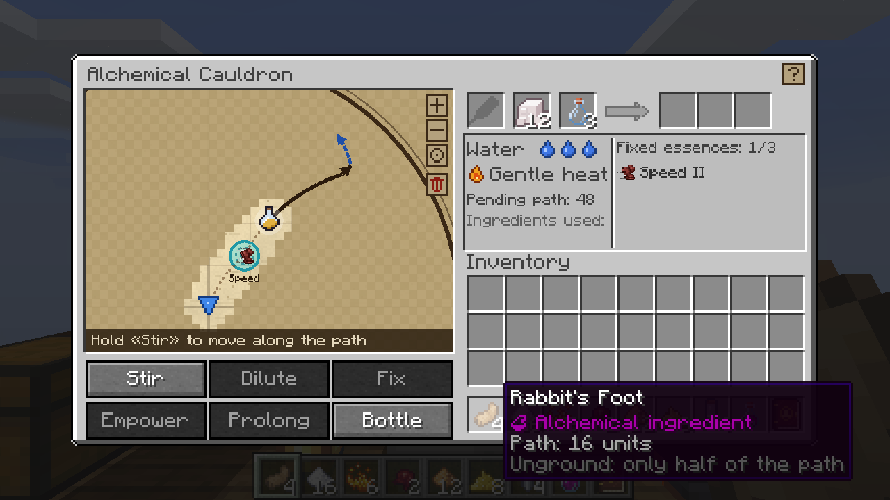
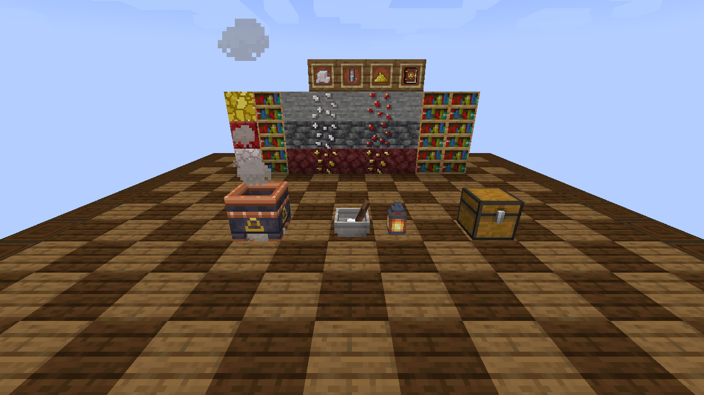
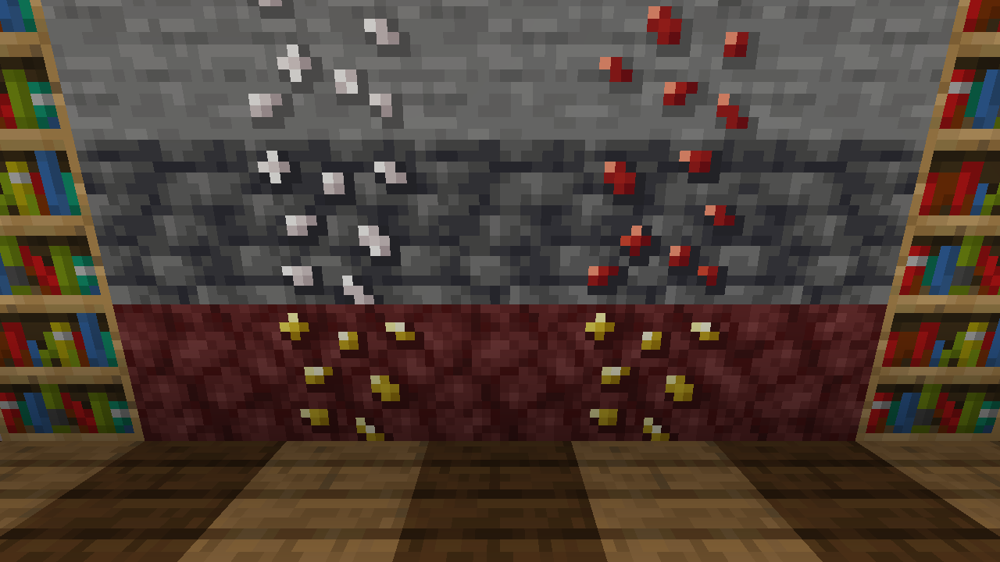
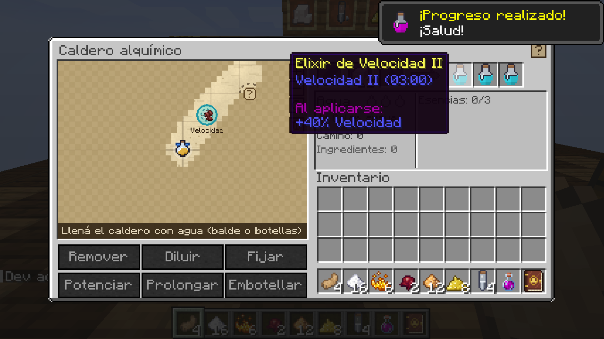
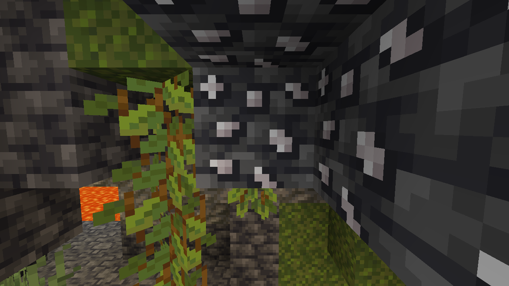
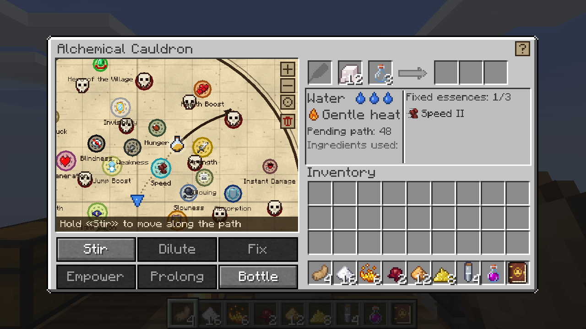
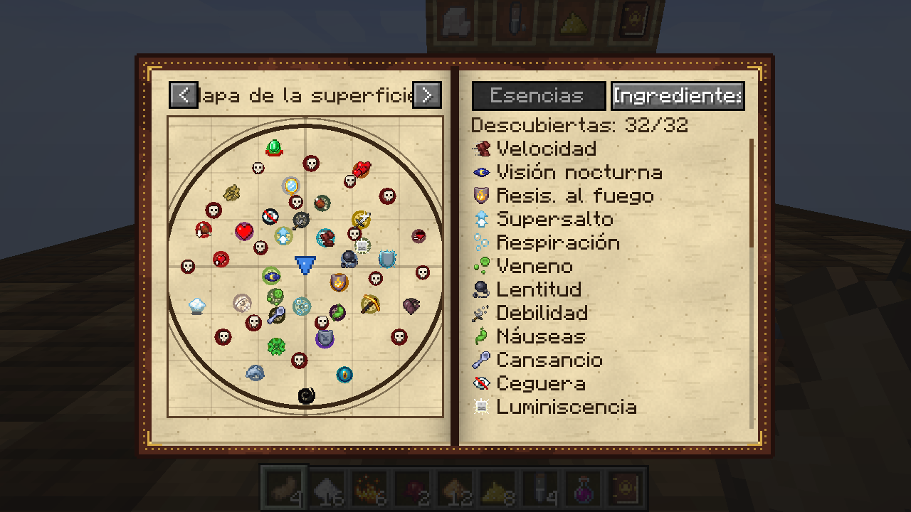

# Alquimia Cartográfica (Minecraft 1.20.1 · Forge)

Alquimia al estilo *Potion Craft*: cada ingrediente traza un camino sobre un **mapa de esencias**.
Removés la mezcla para recorrerlo, la diluís para volver al centro y **fijás esencias** con la
*tria prima* de los alquimistas: **sal**, **mercurio** y **azufre**.

## Instalación

1. Instalá **Forge 1.20.1** (versión 47.x).
2. Descargá [`builds/alquimia-1.20.1-1.0.0.jar`](builds/) y copialo en la carpeta `mods`.
3. Hace falta en el cliente y en el servidor.

## Cómo se juega

1. Minería: **sal** y **cinabrio** en cuevas, **azufre** en el Nether. El cinabrio fundido da **mercurio**.
2. Fabricá el **caldero alquímico**, llenalo con agua (balde o botellas) y ponelo sobre fuego
   (fogata, magma o lava; la lava y el fuego de almas calientan más).
3. Abrilo y poné ingredientes en la ranura de la hoja: cada uno agrega un camino (línea negra).
   Al pasar el ratón por un ingrediente se ve su camino punteado antes de usarlo.
4. Mantené **Remover** para que la mezcla avance. Al pasar por una esencia la descubrís.
5. Sobre una esencia, poné **sal** en la ranura de reactivo y apretá **Fijar**. Cuanto más cerca
   del centro, más nivel. Podés fijar hasta 3 esencias en el mismo elixir.
6. **Azufre** sube un nivel la última esencia (a cambio de duración) y **mercurio** alarga todo.
7. Poné frascos vacíos y **Embotellá** (un elixir por nivel de agua).

Consejos: molé los ingredientes en el **mortero** (clic derecho con la mano vacía) para que recorran su
camino completo. ¡Evitá las calaveras del mapa: la mezcla explota! El **grimorio** guarda lo que
descubriste. Elixir + pólvora = arrojadizo; arrojadizo + aliento de dragón = persistente.

| Receta | Ingredientes |
|---|---|
| Caldero alquímico | 4 lingotes de cobre + caldero + sal |
| Mortero | 3 rocas (roca, pizarra o piedra negra) + palo |
| Grimorio | libro + sal + saco de tinta + pluma |
| Mercurio | fundir cinabrio (horno o alto horno) |
| Pólvora ×2 | azufre + carbón + sal |

## Accesibilidad y configuración

Todo se configura desde **Mods → Alquimia Cartográfica → Config**: mapa de alto contraste,
reducir animaciones, *mantener* o *un clic* para remover, nombres en el mapa, cantidad de vetas
(0 = sin generación), duración de los elixires, explosiones, descubrimientos compartidos en servidores…
Los atajos del caldero se cambian en **Controles** (por defecto: Espacio, D, S, A, M, B, C).
Comandos de administrador: `/alquimia revelar` y `/alquimia olvidar`.

Idiomas: español (con voseo para Argentina y Uruguay) e inglés.

## Más capturas

| | |
|---|---|
|  |  |
|  |  |
|  |  |

## Compilar

Requiere JDK 17: `./gradlew -p mods/alquimia build` (el `.jar` queda en `mods/alquimia/build/libs`).
Las texturas y los JSON se generan con `tools/gen_alquimia_*.py`. La CI de GitHub compila, prueba un
servidor real y toma estas capturas con un cliente automático.
